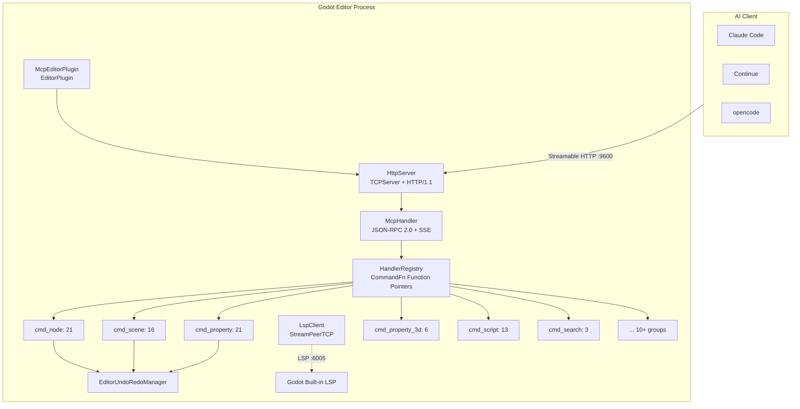
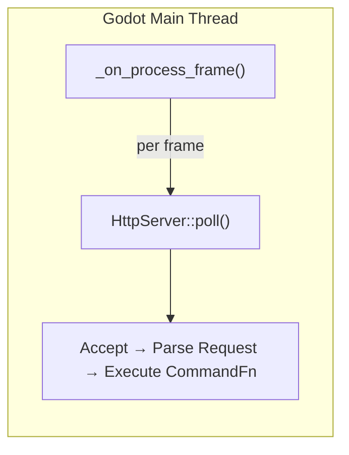
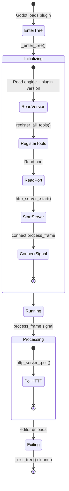
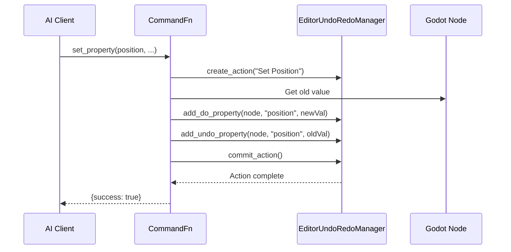

# Architecture

## Overall Architecture



## Core Design Principles

### Pure Main Thread

The entire GDExtension runs on the Godot editor's main thread, **no worker threads, no locks**. The editor frame callback `_on_process_frame()` drives `HttpServer::poll()` to handle requests.



This means:
- **No** `MainThreadDispatcher` required
- **No** cross-thread logging (direct `UtilityFunctions::print`)
- **No** tokio runtime
- No `bind_mut` deadlock risks
- All `cmd_*` functions can call Godot API directly

### Streamable HTTP

Uses JSON-RPC 2.0 as the protocol layer, with Server-Sent Events (SSE) for streaming results, compatible with the MCP Streamable HTTP transport specification.

### Function Pointer Routing

`HandlerRegistry` maintains a map from tool names to `CommandFn` function pointers, dispatching directly on tool name match with no reflection overhead.

## Editor Plugin Lifecycle



## Command Routing Path

Complete tool call flow:

```
Client HTTP POST /mcp {"method":"tools/call","params":{"name":"get_node_position",...}}
 → HttpServer::handle_post()
   → Validate protocol version / Content-Type / Accept / Origin
   → Parse JSON-RPC 2.0 message
 → McpHandler::handle_tools_call()
   → HandlerRegistry::find("get_node_position") → CommandFn
   → Main-thread synchronous CommandFn(args)
   → Wrap response → HTTP 200 + JSON-RPC Response
```

## Directory Structure

```
extensions/src/
├── register_types.cpp       # GDExtension entry (symbol: gdext_rust_init)
├── editor_plugin.cpp/.hpp   # EditorPlugin assembler
├── logging.hpp              # Logging utilities
├── sdk/
│   ├── mcp_tool_definition.cpp/.hpp  # SDK base class (GDScript-inheritable)
│   └── mcp_tool_registry.cpp/.hpp    # Tool registry singleton
├── server/
│   ├── ipc/http_server.cpp/.hpp      # HTTP server
│   ├── mcp/mcp_handler.cpp/.hpp      # MCP session management
│   └── registry/handler_registry.cpp/.hpp  # Tool registration table
├── built_in/
│   ├── cmd_info.cpp         # godot_info (connection + environment info)
│   ├── cmd_meta_tools.cpp   # Progressive disclosure meta-tools (4)
│   ├── cmd_utils.cpp/.hpp   # Utility functions
│   ├── node.cpp             # Node operations (21)
│   ├── property.cpp         # 2D property read/write (21)
│   ├── property_3d.cpp      # 3D property read/write (6)
│   ├── scene.cpp            # Scene file/tab operations (16)
│   ├── script_gd.cpp        # GDScript commands (5)
│   ├── script_cs.cpp        # C# commands (6)
│   ├── script_helpers.cpp   # call_method, get/set_variable (3)
│   ├── collision.cpp        # Collision shape creation (2)
│   ├── find.cpp             # Node search (4)
│   ├── search.cpp           # File search/replace (3)
│   ├── undo.cpp             # undo/redo (2)
│   ├── editor_control.cpp   # Play/stop, refresh (7)
│   ├── project_settings.cpp      # Project settings (7)
│   ├── project_settings_ext.cpp  # Display/physics/rendering settings (10)
│   ├── input_map.cpp        # Input mapping (4)
│   └── plugin_management.cpp     # Plugin management (2)
└── lsp/
    └── client.cpp/.hpp      # LSP validation client
```

## Data Flow

### Undo Support


