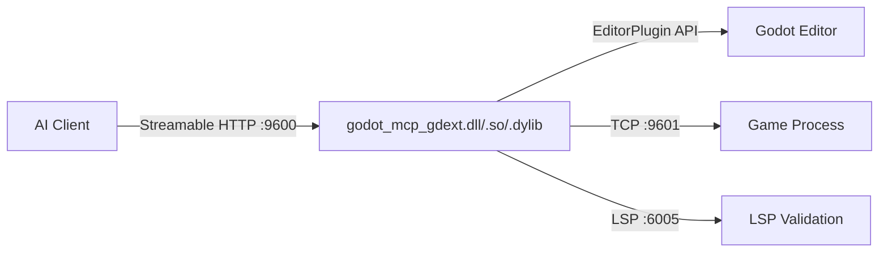

# Getting Started

## Introduction

GodotMCP is an **MCP (Model Context Protocol) server** that runs as a C++ GDExtension inside the Godot 4.6+ editor, exposing editor capabilities to AI coding tools via Streamable HTTP.



## Installation

### Download the Plugin

Download the latest `addons.zip` from the [Releases](https://github.com/jesspig/GodotMCP-GDExtension/releases) page and extract it to your Godot project's `addons/` directory.

### Enable the Plugin

1. Open the Godot Editor → **Project Settings** → **Plugins**
2. Find **GodotMCP** and click **Enable**

The plugin will automatically listen on port `9600` (configurable via the `GODOT_MCP_HTTP_PORT` environment variable).

### Build from Source

```bash
# Clone the repository
git clone https://github.com/jesspig/GodotMCP-GDExtension.git
cd GodotMCP-GDExtension

# Debug build
uv run python build.py

# Release build
uv run python build.py --release

# Build output is in example/addons/godot_mcp/
```

> **Windows Note**: Use `uv run python` (auto-activates `.venv`). You can also use `py -3` — the Microsoft Store python shim may hang silently.

## Configure AI Client

> **Always use project-level configuration**, not global. Only Godot projects with the GodotMCP plugin installed will start the MCP server; a global config will cause connection failures in other projects.

For opencode, add this to `opencode.json` in your project root:

```json
{
  "$schema": "https://opencode.ai/config.json",
  "mcp": {
    "godot-mcp": {
      "type": "remote",
      "url": "http://localhost:9600"
    }
  }
}
```

See [Client Configuration](/en/reference/client-config) for other clients (Cursor, VS Code, Windsurf, Claude Code, Claude Desktop, Continue, Cline, etc.).

## Verify Connection

```bash
curl http://localhost:9600
# Expected: Godot MCP server running
```

Or use any MCP client to call the `ping` tool.
