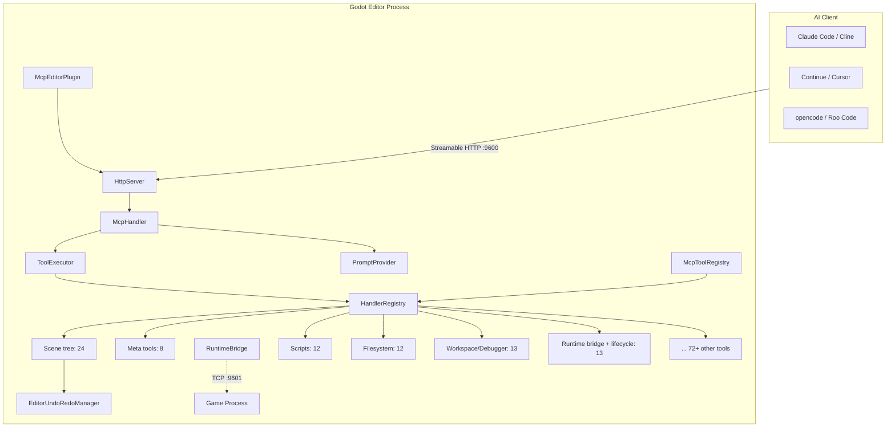
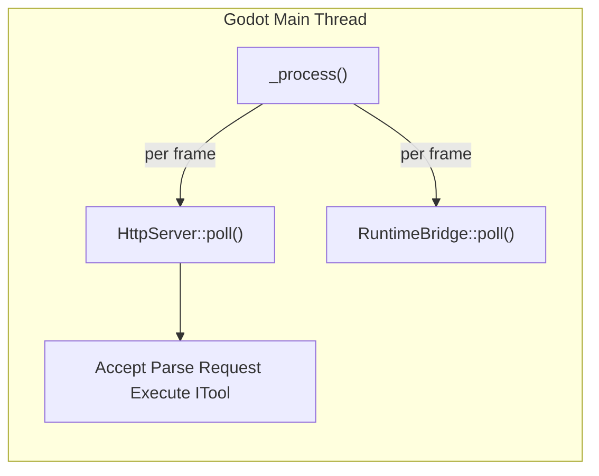
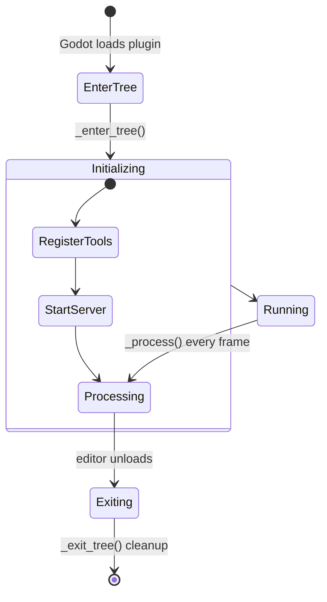
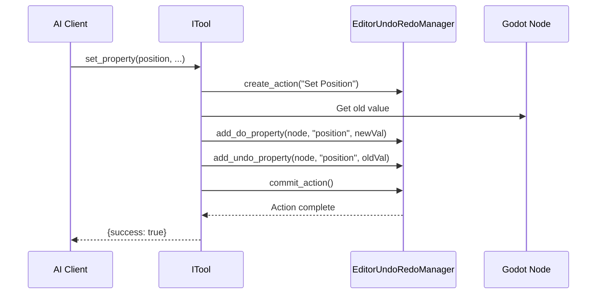

# 架构

## 系统架构



## 核心设计原则

### 纯主线程

整个 GDExtension 运行在 Godot 编辑器的主线程上——**无工作线程，无锁**。`McpEditorPlugin::_process()` 每帧驱动 `HttpServer::poll()` + `RuntimeBridge::poll()`。



这意味着：
- **无需** `MainThreadDispatcher`
- **无需** 跨线程日志（直接使用 `UtilityFunctions::print`）
- **无需** tokio 运行时
- 无 `bind_mut` 死锁风险
- 所有工具均可直接调用 Godot API

### Streamable HTTP（MCP 2026-07-28）

使用 JSON-RPC 2.0，纯 `POST + OPTIONS` 通信。MCP 2026-07-28 升级中已移除会话管理。SSE 事件内联在 POST 响应体中。服务器会根据请求体校验 `Mcp-Method` 和 `Mcp-Name` HTTP 头。

### ITool 架构 + X-macro 注册

每个工具实现 `ITool` 接口（`name()`、`category()`、`input_schema()`、`execute_impl()`），通过 X-macro 注册文件（`register/*.hpp`）自动收集。注册宏：2 个参数（`cls`、`is_destructive_val`）。`HandlerRegistry` 维护一个 ITool 主表 + SDK `CommandFn` 旁路表。

### 四层工具体系

| 层 | 名称 | 数量 | 描述 |
|-------|------|-------|-------------|
| 0 | 通用兜底 | 2 | `get_node_property` / `set_node_property` |
| 1 | 元工具 | 7 | 工具内省、搜索、发现 |
| 2 | 语义工具 | 136 | 面向各个领域的专用工具 |
| 3 | 文档查询工具 | 8 | 基于 ClassDB 的文档查询 |

### 运行时桥接

编辑器通过 `RuntimeBridge`（TCP 客户端，端口 9601）连接到 `GameBridgeNode`（游戏进程中的 TCP 服务器）。支持运行时场景树查询、属性读写、方法调用、截图、输入模拟。所有桥接工具均支持可配置的 `timeout_ms`。

### SDK 层

`McpToolRegistry` 是一个 Engine 单例，可从 GDScript 和 C# 访问。两种注册模式：继承 `McpToolDefinition`（GDVIRTUAL 覆盖）或使用 `register_tool()` 配合 `Callable`。

## 编辑器插件生命周期



## 命令路由路径

完整的工具调用流程：

```
Client HTTP POST /mcp
  -> HttpServer::handle_post()
    -> Validate headers, parse JSON-RPC
  -> McpHandler::handle_message()
    -> ToolExecutor::execute()
      -> HandlerRegistry::find("add_node") -> ITool
      -> ITool::execute() (template method)
      -> Wrap response -> HTTP 200 + JSON-RPC Response
```

## 数据流——撤销支持

