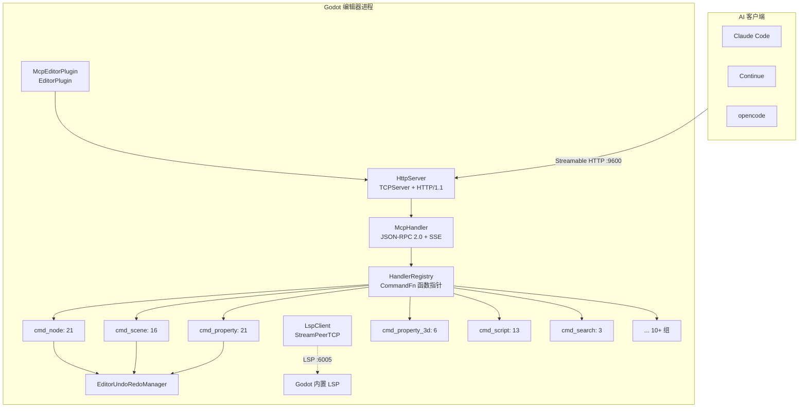
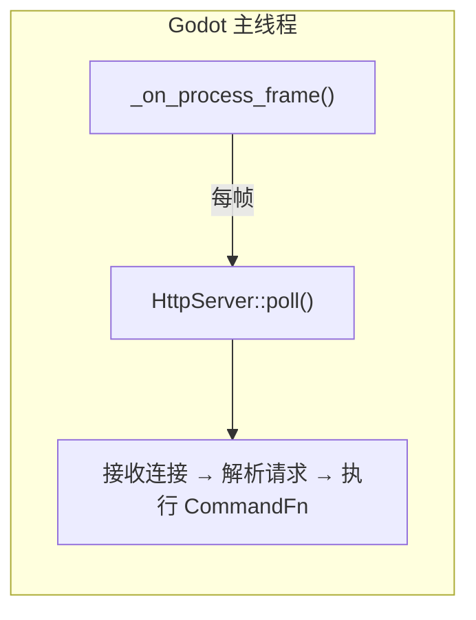
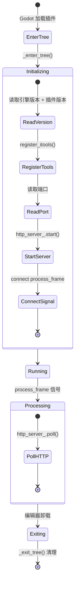
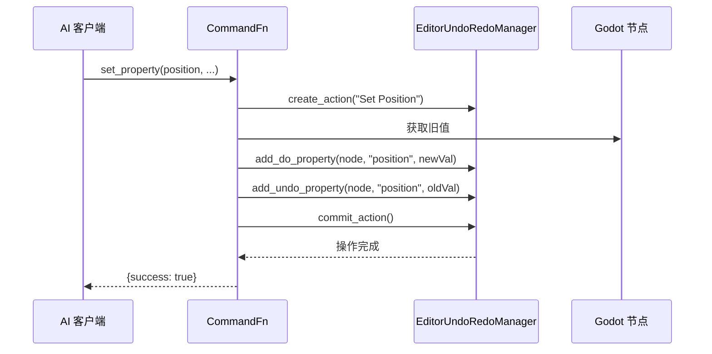

# 架构概览

## 整体架构



## 核心设计原则

### 纯主线程

整个 GDExtension 运行在 Godot 编辑器的主线程上，**无工作线程、无锁**。编辑器帧回调 `_on_process_frame()` 驱动 `HttpServer::poll()` 处理请求。



这意味着：
- **无需** `MainThreadDispatcher`
- **无需** 跨线程日志（直接调用 `UtilityFunctions::print`）
- **无需** tokio 运行时
- 无 `bind_mut` 死锁风险
- 所有 `cmd_*` 函数可以直接调用 Godot API

### Streamable HTTP

采用 JSON-RPC 2.0 作为协议层，通过 Server-Sent Events (SSE) 实现流式结果推送，兼容 MCP Streamable HTTP 传输规范。

### 函数指针路由

`HandlerRegistry` 维护一个从工具名到 `CommandFn` 函数指针的映射表，调用时按命中的工具名直接跳转，无反射开销。

## 编辑器插件生命周期



## 命令路由链路

完整的工具调用链路：

```
客户端 HTTP POST /mcp {"method":"tools/call","params":{"name":"get_node_position",...}}
 → HttpServer::handle_post()
   → 验证协议版本 / Content-Type / Accept / Origin
   → 解析 JSON-RPC 2.0 消息
 → McpHandler::handle_tools_call()
   → HandlerRegistry::find("get_node_position") → CommandFn
   → 主线程同步执行 CommandFn(args)
   → 包装返回值 → HTTP 200 + JSON-RPC Response
```

## 目录结构

```
extensions/src/
├── register_types.cpp       # GDExtension 入口（符号: gdext_rust_init）
├── editor_plugin.cpp/.hpp   # EditorPlugin 组装者
├── logging.hpp              # 日志工具
├── sdk/
│   ├── mcp_tool_definition.cpp/.hpp  # SDK 基类（GDScript 可继承）
│   └── mcp_tool_registry.cpp/.hpp    # 工具注册中心（单例）
├── server/
│   ├── ipc/http_server.cpp/.hpp      # HTTP 服务器
│   ├── mcp/mcp_handler.cpp/.hpp      # MCP 会话管理
│   └── registry/handler_registry.cpp/.hpp  # 工具注册表
├── built_in/
│   ├── cmd_info.cpp         # godot_info（连接状态+环境信息）
│   ├── cmd_meta_tools.cpp   # 渐进式披露 meta-tools（4）
│   ├── cmd_utils.cpp/.hpp   # 工具函数
│   ├── node.cpp             # 节点操作（21）
│   ├── property.cpp         # 2D 属性读写（21）
│   ├── property_3d.cpp      # 3D 属性读写（6）
│   ├── scene.cpp            # 场景文件/标签页操作（16）
│   ├── script_gd.cpp        # GDScript 命令（5）
│   ├── script_cs.cpp        # C# 命令（6）
│   ├── script_helpers.cpp   # call_method、get/set_variable（3）
│   ├── collision.cpp        # 碰撞体创建（2）
│   ├── find.cpp             # 节点搜索（4）
│   ├── search.cpp           # 文件搜索/替换（3）
│   ├── undo.cpp             # undo/redo（2）
    ├── editor_control.cpp   # 播放/停止、刷新（7）
    ├── project_settings.cpp      # 项目设置（7）
    ├── project_settings_ext.cpp  # 显示/物理/渲染设置（10）
    ├── input_map.cpp        # 输入映射（4）
    └── plugin_management.cpp     # 插件管理（2）
```

## 数据流

### 撤销支持


