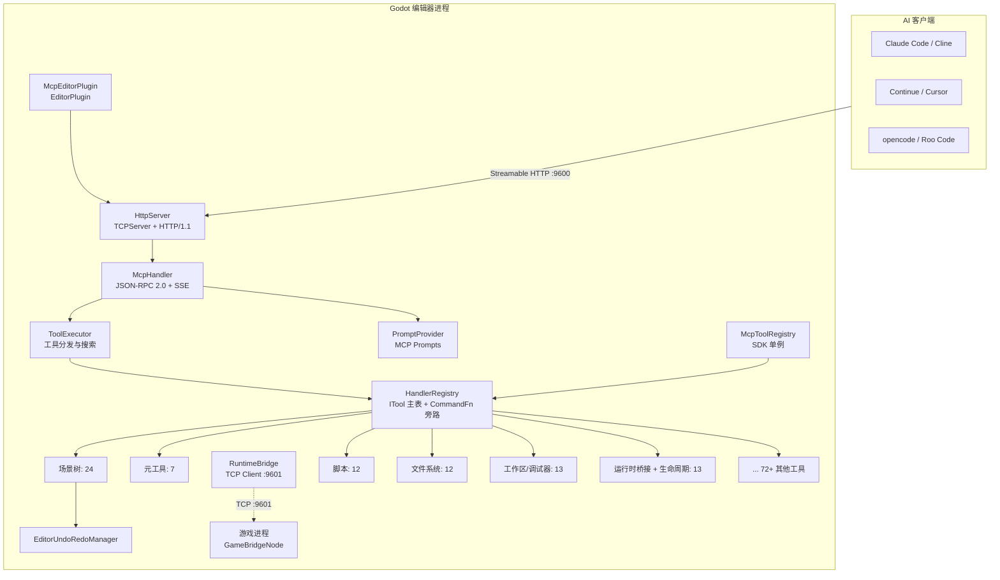
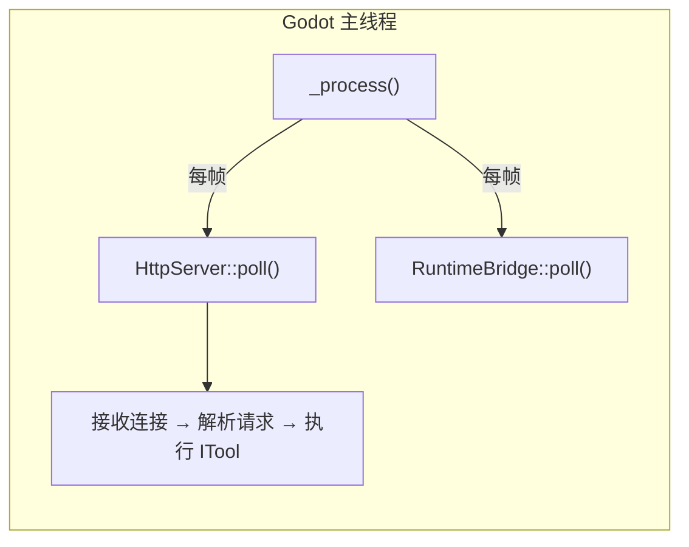
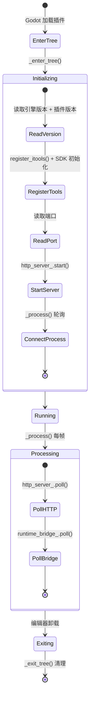
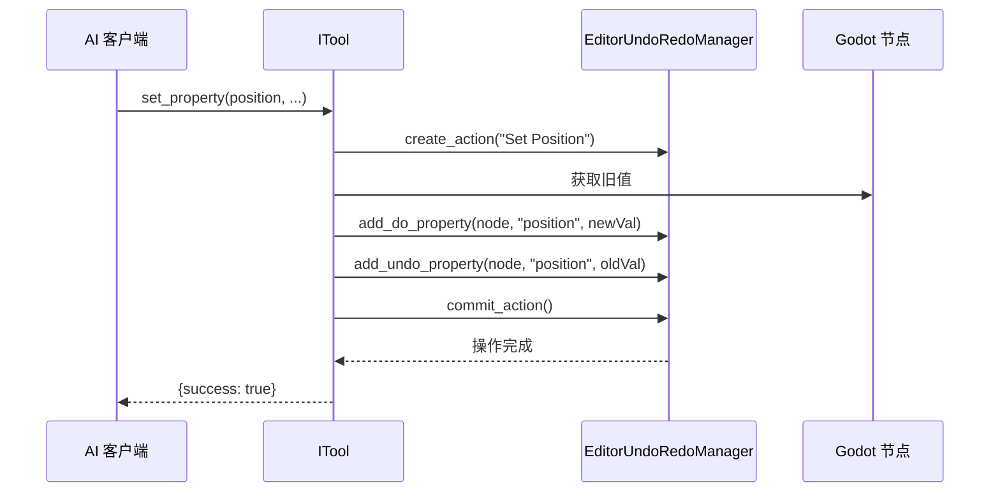

# 架构概览

## 整体架构



## 核心设计原则

### 纯主线程

整个 GDExtension 运行在 Godot 编辑器的主线程上，**无工作线程、无锁**。`McpEditorPlugin::_process()` 每帧驱动 `HttpServer::poll()` + `RuntimeBridge::poll()` 处理请求。



这意味着：
- **无需** `MainThreadDispatcher`
- **无需** 跨线程日志（直接调用 `UtilityFunctions::print`）
- **无需** tokio 运行时
- 无 `bind_mut` 死锁风险
- 所有工具可以直接调用 Godot API

### Streamable HTTP（MCP 2026-07-28）

采用 JSON-RPC 2.0 作为协议层，通过纯 `POST + OPTIONS` 通信。v0.2.1 已移除会话管理（原 `Mcp-Session-Id`、`GET /mcp`、`DELETE /mcp`、`initialize` 握手）。SSE 事件内联在 POST 响应体中推送。服务器校验 `Mcp-Method` 和 `Mcp-Name` HTTP 头与请求 body 的一致性。

### ITool 架构 + X-macro 注册

每个工具实现 `ITool` 接口（`name()`、`category()`、`input_schema()`、`execute_impl()`），通过 X-macro 注册文件（`register/*.hpp`）自动收集。v0.2.1 中注册宏从 6 参数简化为 2 参数（`cls`、`is_destructive_val`）。`HandlerRegistry` 维护 ITool 主表 + SDK `CommandFn` 旁路表，支持 `find_tool` 搜索引擎和渐进式工具发现。

### 运行时桥接

编辑器进程通过 TCP 客户端（`RuntimeBridge`，端口 9601）连接游戏进程内的 `GameBridgeNode` TCP 服务端，支持运行时场景树查询、属性读写、方法调用、截图、输入模拟等操作。编辑器通过 `is_playing_scene()` 自动感知游戏启停。所有桥接工具支持可配置的 `timeout_ms` 参数。

### SDK 层

`McpToolRegistry` 注册为 Engine 单例，GDScript 和 C# 均可访问。支持两种注册模式：继承 `McpToolDefinition`（覆盖 `execute()` GDVIRTUAL）或使用 `register_tool()` + `Callable` 处理器。

## 编辑器插件生命周期



## 命令路由链路

完整的工具调用链路：

```
客户端 HTTP POST /mcp {"method":"tools/call","params":{"name":"add_node",...}}
  → HttpServer::handle_post()
    → 验证 Content-Type / Accept / Origin / Mcp-Method
    → 解析 JSON-RPC 2.0 消息
  → McpHandler::handle_message()
    → ToolExecutor::execute()
      → HandlerRegistry::find("add_node") → ITool
      → ITool::execute() (模板方法: schema 校验 → 上下文解析 → execute_impl())
      → 包装返回值 → HTTP 200 + JSON-RPC Response
```

## 目录结构

```
extensions/src/
├── register_types.cpp       # GDExtension 入口（符号: gdext_mcp_init）
├── editor_plugin.cpp/.hpp   # EditorPlugin 组装者
├── client_config_registry.hpp # MCP 客户端配置模板（11 种客户端）
├── sdk/
│   ├── mcp_tool_definition.cpp/.hpp  # SDK 基类（GDScript 可继承）
│   └── mcp_tool_registry.cpp/.hpp    # 工具注册中心（单例）
├── server/
│   ├── ipc/http_server.cpp/.hpp      # HTTP 服务器（CORS、SSE、Header 校验）
│   ├── http/http_parser.cpp/.hpp     # HTTP 请求解析器
│   └── mcp/
│       ├── mcp_handler.cpp/.hpp      # MCP 协议处理器（无会话）
│       ├── tool_executor.cpp/.hpp    # 工具分发与搜索
│       └── prompt_provider.cpp/.hpp  # MCP Prompts 支持
├── registry/
│   └── handler_registry.cpp/.hpp    # 工具注册表（ITool + CommandFn + 搜索）
├── built_in/
│   ├── tool_base.cpp/.hpp           # ITool 基类 + 类型验证
│   ├── tool_adapter.cpp/.hpp        # IToolAdapter（SDK 桥接）
│   ├── cmd_utils.cpp/.hpp           # 工具函数（resolve_node, undoable_set 等）
│   ├── cmd_utils_json.cpp           # JSON ↔ Variant 转换
│   ├── cmd_utils/                   # 共享工具模板（7 个 .hpp）
│   │   ├── dispatch_map.hpp         # if/else 链的 DispatchMap
│   │   ├── undo_helpers.hpp         # 撤销/重做辅助模板
│   │   ├── args_get_typed.hpp       # 类型安全参数提取
│   │   ├── schema_builder.hpp       # 输入 schema 流式构建器
│   │   ├── error_codes.hpp          # 标准错误码
│   │   ├── memdelete_guard.hpp      # 安全 memdelete 包装
│   │   └── tracked_settings.hpp     # 设置变更追踪器
│   ├── screenshot_utils.hpp         # 截图工具
│   ├── register_itools.cpp          # #include 汇总 + X-macro 注册
│   └── tools/
│       ├── meta/                    # 元工具 (7)
│       ├── signal/                  # 信号管理 (4)
│       ├── group/                   # 节点组 (4)
│       ├── node_tools/              # 资源操作 (6) + 兜底 (2)
│       ├── editor_tools/            # 编辑器工具集
│       │   ├── scene_tree/          # 场景树操作 (24)
│       │   ├── scripts/             # 脚本读写 (12, GD + C# 变体)
│       │   ├── filesystem/          # 文件系统 (12)
│       │   ├── workspace/           # 工作区 + 调试器 (13, 合并后)
│       │   ├── animation/           # 动画 (10, 含 AnimationTree)
│       │   ├── audio/               # 音频 (3) — 新增
│       │   ├── navigation/          # 导航 (3) — 新增
│       │   ├── 3d_scene/            # 3D 场景 (3) — 新增
│       │   ├── control/             # UI 控件 (4)
│       │   ├── collision/           # 碰撞体 (1)
│       │   ├── docs/                # ClassDB 文档查询 (8)
│       │   ├── export/              # 导出 (4)
│       │   ├── inputmap/            # 输入映射 (4)
│       │   ├── plugin/              # 插件管理 (2)
│       │   ├── scaffold/            # 项目脚手架 (1)
│       │   ├── settings/            # 项目设置 (4)
│       │   ├── shader/              # 着色器 (5)
│       │   ├── tilemap/             # TileMap (3)
│       │   └── visualizer/          # 项目图可视化 (1)
│       ├── runtime_tools/           # 运行时工具
│       │   ├── bridge/              # 运行时桥接 (7)
│       │   └── lifecycle/           # 生命周期控制 (6)
│       └── register/                # X-macro 注册文件
├── runtime/
│   ├── bridge.cpp/.hpp             # 编辑器侧 TCP 客户端
│   └── game_bridge.cpp/.hpp        # 游戏进程内 TCP 服务端
├── ui/                              # UI 组件 — 新增
│   ├── mcp_dock.cpp/.hpp           # 编辑器右侧面板
│   ├── mcp_console.cpp/.hpp        # 编辑器输出控制台
│   └── mcp_logger.cpp/.hpp         # C++ 结构化日志器
└── testing/                        # YAML 测试引擎（流水线架构）
    ├── pipeline_parser.cpp/.hpp    # 流水线 YAML 解析器
    ├── pipeline_runner.cpp/.hpp    # 流水线执行器
    ├── pipeline_context.cpp/.hpp   # 流水线上下文
    ├── pipeline_types.hpp          # 流水线类型定义
    ├── test_engine.cpp/.hpp        # 核心测试引擎
    ├── yaml_parser.hpp             # YAML 解析工具
    └── test_assertions.hpp         # 测试断言助手
```

## 数据流

### 撤销支持


