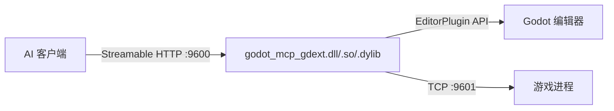

# 快速开始

## 项目简介

GodotMCP 是一个 **MCP (Model Context Protocol) 服务器**，以 C++ GDExtension 形式运行在 Godot 4.6+ 编辑器中，通过 Streamable HTTP 将编辑器能力暴露给 AI 编码工具。



## 安装

### 下载插件

从 [Releases](https://github.com/jesspig/GodotMCP-GDExtension/releases) 页面下载最新 `addons.zip`，解压到你的 Godot 项目 `addons/` 目录。

### 启用插件

1. 打开 Godot 编辑器 → **项目设置** → **插件**
2. 找到 **GodotMCP**，点击 **启用**

插件启动后会自动监听 `9600` 端口（可通过环境变量 `GODOT_MCP_HTTP_PORT` 修改）。

### 自构建

```bash
# 克隆仓库
git clone https://github.com/jesspig/GodotMCP-GDExtension.git
cd GodotMCP-GDExtension

# Debug 构建
uv run python main.py build

# Release 构建
uv run python main.py build --release

# 构建输出在 example/addons/godot_mcp/
```

> **Windows 注意**：推荐使用 `uv run python`（自动激活 `.venv`）。也可使用 `py -3`——Microsoft Store 的 python 路由可能会导致卡死。

## 配置 AI 客户端

> **务必在项目级别配置**，不要全局配置。只有安装了 GodotMCP 插件的 Godot 项目才会启动 MCP 服务器，全局配置会导致其他项目一直连接失败。

以 opencode 为例，在项目根目录的 `opencode.json` 中添加：

```json
{
  "$schema": "https://opencode.ai/config.json",
  "mcp": {
    "godot-mcp": {
      "type": "remote",
      "url": "http://localhost:9600"
    }
  }
}
```

其他客户端（Cursor、VS Code、Windsurf、Claude Code、Claude Desktop、Continue、Cline 等）配置请参考 [客户端配置](/reference/client-config)。

## 验证连接

```bash
curl http://localhost:9600/mcp
# 预期返回: 405 Method Not Allowed（或使用 POST 的正常响应）
```

或通过任意 MCP 客户端调用 `ping` 工具确认连接状态。
